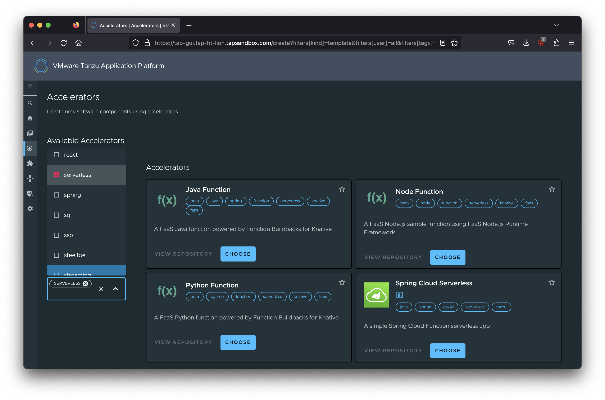
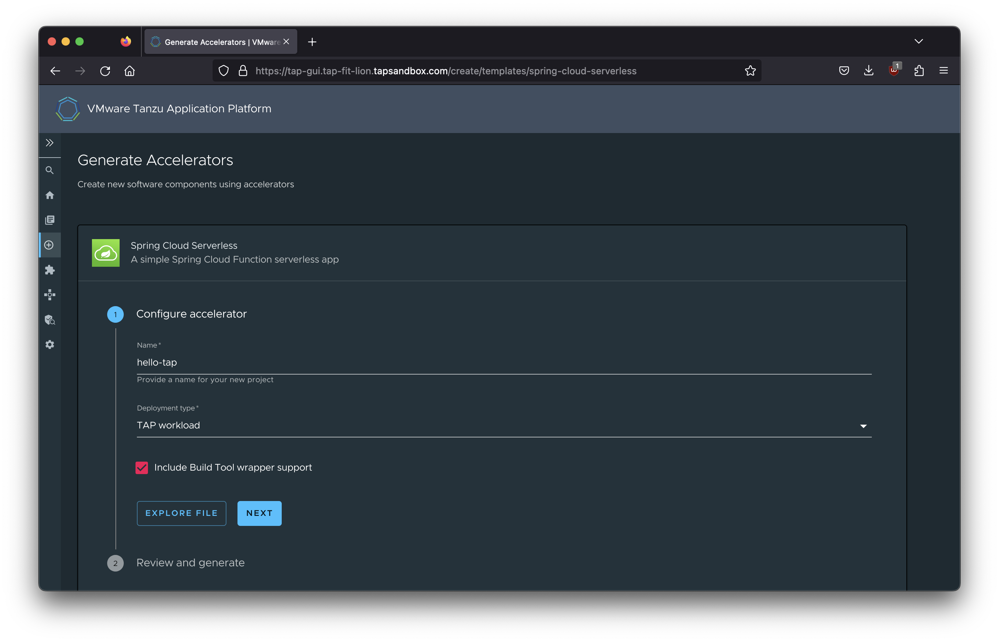

# Native build with TAP

## Generating a new project from an accelerator

We can kickstart our app development using one of the sample accelerators provided by TAP. We select all accelerators that are tagged as "serverless".



Let's start by selecting the "Spring Cloud Serverless" accelerator which sounds like a good fit for native builds.



We give it a name of "hello-tap" and hit the `NEXT` button which let's us review and then select `GENERATE ACCELERATOR` to create a ZIP file with our new project that we can download.

Once downloaded, we'll unzip this archive and can now start developing our new project.

```sh
unzip ~/Downloads/hello-tap.zip
cd hello-tap
```

The download project contains a `workload.yaml` file in the `config` directory and we can modify this file so we can have the project built as a GraalVM native image.

```yaml
apiVersion: carto.run/v1alpha1
kind: Workload
metadata:
  name: hello-tap
  labels:
    apps.tanzu.vmware.com/workload-type: web
    apps.tanzu.vmware.com/has-tests: "true"
    apps.tanzu.vmware.com/auto-configure-actuators: "true"
    app.kubernetes.io/part-of: hello-tap
spec:
  build:
    env:
      - name: BP_NATIVE_IMAGE
        value: "false"
      - name: BP_JVM_VERSION
        value: "17"
      - name: BP_MAVEN_BUILD_ARGUMENTS
        value: "-Pnative -Dmaven.test.skip=true --no-transfer-progress package"
  source:
    git:
      url: <https URL for your generated project's Git repository>
      ref:
        branch: main
```

We change the `spec.build.env` entry for `BP_NATIVE_IMAGE` to `"true"`. 

## Building the project

Once the change for the native build is done, we can build this project from the local source files using:

> Note: The following command assumes you want to deply to the `apps` namespace and that your local-source-proxy feature is enabled for the cluster you are using.

```sh
tanzu apps workload apply --file ./config/workload.yaml --namespace apps --local-path .
```

We can then follow the progress of the workload winding its way through the supply chain using:

```sh
tanzu apps workload get hello-tap
```

Since this is a native build, it could take 10 minutes or longer to complete, so be patient.

## Access the app

Once the Knative service is available you should be able to capture the URL by running:

```sh
APP_URL=$(kubectl get service.serving.knative.dev/hello-tap -ojsonpath='{.status.url}')
```

Then you can use CURL to invoke the app:

```sh
curl -H 'content-type: text/plain' $APP_URL -d SpringOne
```

You should see a message like the following:

```
% curl $APP_URL                                                                            
Hello SpringOne
```

## Check the startup logs of the app

You can access the logs by running:

```sh
kubectl logs deploy/hello-tap-00001-deployment -c workload
```

And you should see something like this:

```
  .   ____          _            __ _ _
 /\\ / ___'_ __ _ _(_)_ __  __ _ \ \ \ \
( ( )\___ | '_ | '_| | '_ \/ _` | \ \ \ \
 \\/  ___)| |_)| | | | | || (_| |  ) ) ) )
  '  |____| .__|_| |_|_| |_\__, | / / / /
 =========|_|==============|___/=/_/_/_/
 :: Spring Boot ::                (v3.1.0)

2023-08-10T02:55:04.546Z  INFO 1 --- [           main] c.example.helloapp.HelloAppApplication   : Starting AOT-processed HelloAppApplication using Java 17.0.6 with PID 1 (/workspace/com.example.helloapp.HelloAppApplication started by root in /workspace)
2023-08-10T02:55:04.546Z  INFO 1 --- [           main] c.example.helloapp.HelloAppApplication   : No active profile set, falling back to 1 default profile: "default"
2023-08-10T02:55:04.584Z  INFO 1 --- [           main] o.s.b.w.embedded.tomcat.TomcatWebServer  : Tomcat initialized with port(s): 8080 (http)
2023-08-10T02:55:04.585Z  INFO 1 --- [           main] o.apache.catalina.core.StandardService   : Starting service [Tomcat]
2023-08-10T02:55:04.585Z  INFO 1 --- [           main] o.apache.catalina.core.StandardEngine    : Starting Servlet engine: [Apache Tomcat/10.1.8]
2023-08-10T02:55:04.595Z  INFO 1 --- [           main] o.a.c.c.C.[Tomcat].[localhost].[/]       : Initializing Spring embedded WebApplicationContext
2023-08-10T02:55:04.595Z  INFO 1 --- [           main] w.s.c.ServletWebServerApplicationContext : Root WebApplicationContext: initialization completed in 49 ms
2023-08-10T02:55:04.696Z  WARN 1 --- [           main] i.m.c.i.binder.jvm.JvmGcMetrics          : GC notifications will not be available because MemoryPoolMXBeans are not provided by the JVM
2023-08-10T02:55:04.706Z  INFO 1 --- [           main] o.s.c.f.web.mvc.FunctionHandlerMapping   : FunctionCatalog: org.springframework.cloud.function.context.catalog.BeanFactoryAwareFunctionRegistry@3ee610c9
2023-08-10T02:55:04.709Z  INFO 1 --- [           main] o.s.b.a.e.web.EndpointLinksResolver      : Exposing 1 endpoint(s) beneath base path '/actuator'
2023-08-10T02:55:04.727Z  INFO 1 --- [           main] o.s.b.w.embedded.tomcat.TomcatWebServer  : Tomcat started on port(s): 8080 (http) with context path ''
2023-08-10T02:55:04.729Z  INFO 1 --- [           main] c.example.helloapp.HelloAppApplication   : Started HelloAppApplication in 0.215 seconds (process running for 0.236)
2023-08-10T02:55:05.188Z  INFO 1 --- [nio-8080-exec-1] o.a.c.c.C.[Tomcat].[localhost].[/]       : Initializing Spring DispatcherServlet 'dispatcherServlet'
2023-08-10T02:55:05.189Z  INFO 1 --- [nio-8080-exec-1] o.s.web.servlet.DispatcherServlet        : Initializing Servlet 'dispatcherServlet'
2023-08-10T02:55:05.189Z  INFO 1 --- [nio-8080-exec-1] o.s.web.servlet.DispatcherServlet        : Completed initialization in 0 ms
```

Here you can verify that this is an "AOT-processed HelloAppApplication using Java 17.0.6" and that the startup time was logged as "Started HelloAppApplication in 0.215 seconds (process running for 0.236)", that's pretty fast for a Java app.

## More advanced configurations

This first Spring Cloud Function sample was fairly simple and did not require a lot of configuration. Once you add database connection and deploy a regular web app you will need additional configuration for the build step to detect everything that should be included in the native image. There is an example project that was generated from the "Tanzu Java Restful Web App" sample accelerator available at https://github.com/trisberg/customer-profile.

The `workload.yaml` file has many additional `spec.build.env` entries, basically all of the same env vars that are provided for the deployed app.

```yaml
apiVersion: carto.run/v1alpha1
kind: Workload
metadata:
  name: customer-profile
  labels:
    apps.tanzu.vmware.com/workload-type: web
    app.kubernetes.io/part-of: customer-profile
    apps.tanzu.vmware.com/has-tests: "true"
    apps.tanzu.vmware.com/auto-configure-actuators: "true"
spec:
  build:
    env:
    - name: BP_JVM_VERSION
      value: "17"
    - name: BP_NATIVE_IMAGE
      value: "true"
    - name: BP_MAVEN_ACTIVE_PROFILES
      value: "native"
    - name: MANAGEMENT_HEALTH_PROBES_ENABLED
      value: "true"
    - name: MANAGEMENT_ENDPOINT_HEALTH_PROBES_ADD_ADDITIONAL_PATHS
      value: "true"
    - name: MANAGEMENT_ENDPOINT_HEALTH_SHOW_DETAILS
      value: always
    - name: MANAGEMENT_ENDPOINTS_WEB_BASE_PATH
      value: /actuator
    - name: MANAGEMENT_ENDPOINTS_WEB_EXPOSURE_INCLUDE
      value: '*'
    - name: MANAGEMENT_SERVER_PORT
      value: "8081"
    - name: SERVER_PORT
      value: "8080"
    - name: SERVICE_BINDING_ROOT
      value: /bindings
    - name: ORG_SPRINGFRAMEWORK_CLOUD_BINDINGS_BOOT_ENABLE
      value: "true"
  env:
  - name: MANAGEMENT_HEALTH_PROBES_ENABLED
    value: "true"
  - name: MANAGEMENT_ENDPOINT_HEALTH_PROBES_ADD_ADDITIONAL_PATHS
    value: "true"
  - name: MANAGEMENT_ENDPOINT_HEALTH_SHOW_DETAILS
    value: always
  - name: MANAGEMENT_ENDPOINTS_WEB_BASE_PATH
    value: /actuator
  - name: MANAGEMENT_ENDPOINTS_WEB_EXPOSURE_INCLUDE
    value: '*'
  - name: MANAGEMENT_SERVER_PORT
    value: "8081"
  - name: SERVER_PORT
    value: "8080"
  - name: SERVICE_BINDING_ROOT
    value: /bindings
  - name: ORG_SPRINGFRAMEWORK_CLOUD_BINDINGS_BOOT_ENABLE
    value: "true"
  params:
    - name: annotations
      value:
        autoscaling.knative.dev/minScale: "1"
  source:
    git:
      url: https://github.com/trisberg/customer-profile
      ref:
        branch: main
  serviceClaims:
    - name: database
      ref:
        apiVersion: services.apps.tanzu.vmware.com/v1alpha1
        kind: ClassClaim
        name: customer-database
```

Before deploying this app, you would need to create a database that will be used by the app:

```sh
tanzu service class-claim create customer-database --class postgresql-unmanaged -n apps
```
